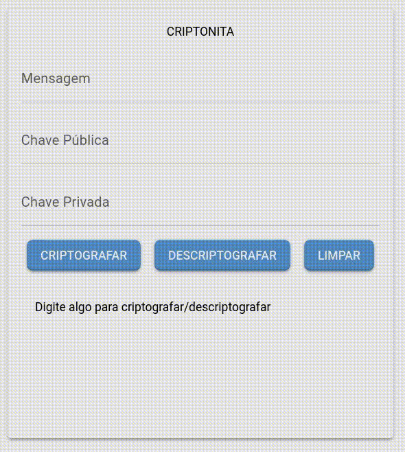

# APS - Criptografia em python

**Atividades Pŕaticas Supervisionadas** são tarefas que os alunos precisam fazer para cumprir as exigências do curso. Essas atividades podem incluir idas à biblioteca, trabalhos em grupo ou individuais, resolução de exercícios supervisionados pelos professores, trabalhos científicos e seminários. 

Durante este semestre, fomos desafiados pelo nosso orientador a desenvolver uma criptografia em Python. Além disso, decidimos também criar uma interface intuitiva e funcional.



## Dependências

Essa aplicação depende do python, e da biblioteca "NiceGUI", que pode ser instalada pelo pip:

``` sh
pip install nicegui
```
